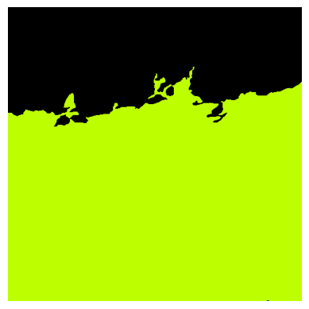

# Skin Image Segmentation Using Connected Component Labeling
## Flow Diagram

## Data Analysis
For each image a corresponding mask highlighted the different layers with a specific color.

### Selecting Intensity Range
To identify intensities for layers their histogram were plotted and analyzed.
Intensity range (vSet) was selected based on highest occurring values and further refined after reviewing the output.

| Layer                      | Intensity Range  |
|----------------------------|------------------|
| Dermal-Epidermal Junction  | 40 - 250         |
| Dermis                     | 20 - 60, 185 - 253|
| Epidermis                  | 125 - 200        |
| Keratin                    | 235 - 256        |
| Background                 | 248 - 255        |

## Layer Extraction
### Connected Component Labeling (CCL)
- Each layer is extracted through CCL except Dermal-Epidermal Junction (DEJ)
- The largest component is selected as the layer and rest are discarded

### Post processing
- The acquired masks have gaps in between the layers. To fix this CCA is used to identify black pixels in that layer’s mask if their size is under a certain threshold they are removed.
- The black pixels are removed by assigning them the same value as the layer itself.

### Dermal-Epidermal Junction (DEJ)
- DEJ is the layer highlighted in pink, it only exists where Dermis (Green) and Epidermal (Purple) layers meet
- The results using CCL were very vague and not correct

- Instead of opting for CCL, DEJ is highlighted where the two layers Dermis and Epidermis are in close vicinity

## Combining layers
The layers are put on top of each other in the following manner

- Keratin 
- Dermis
- Epidermis
- Dermal-Epidermal Junction
- Background

Background has the highest priority

## Results
Input

Original Mask

Predicted Mask

## Dice Coefficient
The average Dice Coefficient was 0.87